# Mini Tokyo 3D User Guide

日本語版は[こちら](https://minitokyo3d.com/docs/master/ja/)でご覧いただけます。

This document describes how to use Mini Tokyo 3D and its features. For more information for developers, see the [Mini Tokyo 3D Developer Guide](https://minitokyo3d.com/docs/master/developer-guide/).

## Mini Tokyo 3D Overview

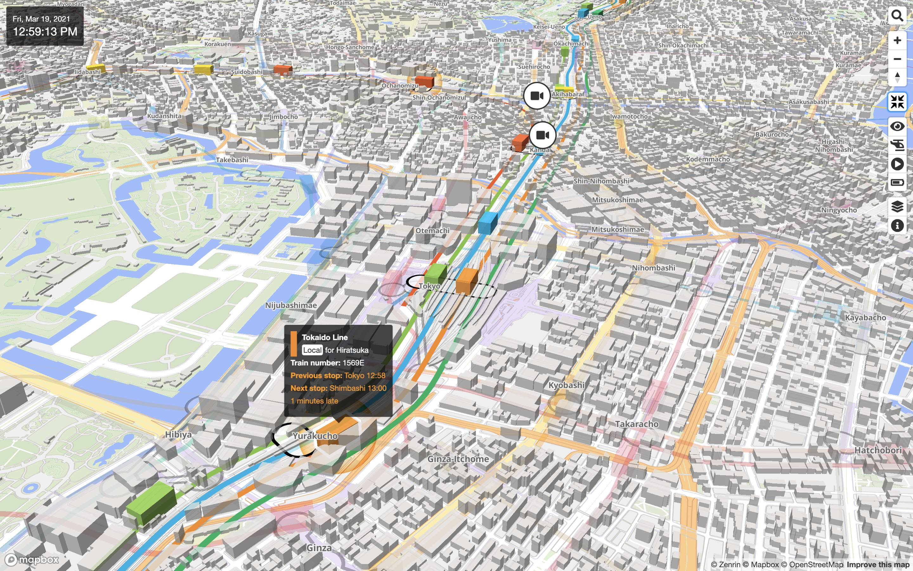

Mini Tokyo 3D is a real-time 3D map of public transportation in Tokyo. Trains in operation and airplanes that are arriving or departing are represented on a realistic 3D map with smooth animation. This is a “digital twin” that looks exactly like the real world in the digital world.

Users can freely move around on the 3D map and zoom in on the places they want to see to know the “now” of Tokyo. It can be used in various ways such as looking for the transfer route as a route map, checking the destination town and weather before going out, just watching the way along the railway by automatically tracking a train and judging if you should dash to not miss the final train from the current position of the train.

Mini Tokyo 3D is a web application that you can run in any web browser, regardless of device, such as PCs, smartphones, tablets, and set-top boxes. Please use the following URL to access.

[https://minitokyo3d.com](https://minitokyo3d.com)

The features of Mini Tokyo 3D are as follows.

### All in Real-Time

You can view trains and airplanes that operate according to actual timetables and real-time delay information from your favorite point of view. The color of the scenery changes according to the sunrise and sunset times in Tokyo, and the sunset glow can be seen. In addition, a rain animation based on real-time weather information is displayed, so you can enjoy more realistic scenery.

### Easy-To-Read Railroad Map

Mini Tokyo 3D is using the same line colors used in official route maps and guidance, and arranges each railway at an appropriate interval according to the scale of the map to display the route in an easy-to-read form. If the names of two or more stations are different, but passengers can transfer from one to others, the connections between the stations are displayed to support smooth transfer. The shape of the train is a simple solid color cuboid that enhances symbolism.

### Operability and Performance

Over 1,900 trains run at the same time during the rush hour, but with the optimized data structure and processing logic, a very smooth operation animation is realized even on smartphones. Smooth animation of 60 frames per second is used everywhere, including viewpoint movement, switching between overground and underground views, and fading in and out of trains and airplanes.

### Support for 4 Languages

In addition to Japanese, Mini Tokyo 3D supports English, Chinese (Simplified and Traditional) and Korean, which are popular with tourists visiting Japan. Not only the user interface texts but also railway names, station names, train types, airport names and airline names are also multilingualized. For the user interface texts, Thai and Nepali are also supported.

### Train Operation and Display as Close as Possible to Reality

Fine tuning of the starting acceleration and maximum speed of the trains was done repeatedly by getting on them, so that they would move in the same way as the actual trains. The underground tunnel sections of the overground railways and the overground sections of the subways are also completely reproduced.

### Switching Views Between Overground and Underground

 

The railway network in Tokyo is one of the most complex in the world. Mini Tokyo 3D is pursuing ease of viewing by switching between the overground and underground railway networks as well as clearly expressing subway train operations that are invisible in reality.

## Screen and Operations

### Screen Description

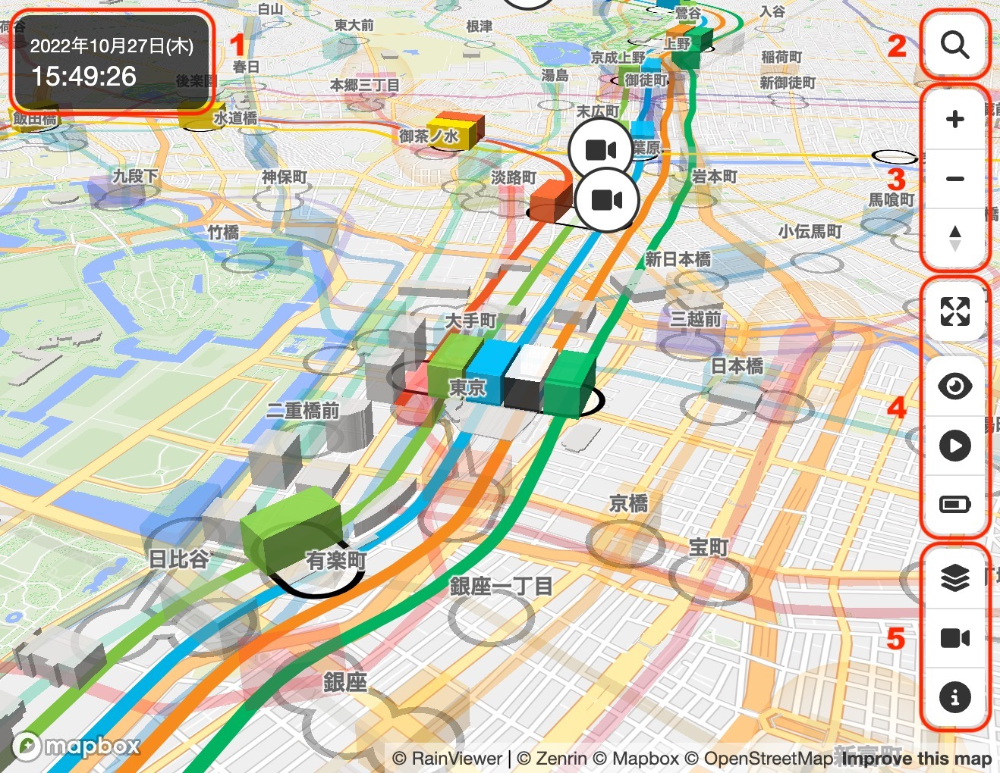

1. **Date and Time**: See [Date and Time](#date-and-time)
2. **Search Button**: See [Route Search](#route-search)
3. **Navigation Buttons**: See [Zooming-In/Out](#zooming-inout) and [Rotation and Tilting](#rotation-and-tilting)
4. **Display Mode Switching Buttons**: See [Display Modes](#display-modes)
5. **Configuration Buttons**: See [Configuration](#configuration)

### Panning

You can move your location by panning the map with a mouse or finger drag. You can also pan the map with the arrow keys on your keyboard.

### Zooming-In/Out

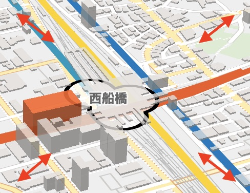 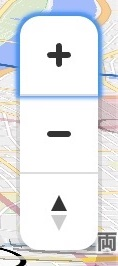

Click or tap the “+” or “−” icon button to zoom in or out the map. You can also zoom in or out by rotating the mouse wheel or pinching in or out of the screen.

You can zoom in or out the map by pressing the “=” or “−” key on the keyboard. You can also zoom in the map by double-clicking with the mouse or triple-tapping, or zoom out by double-clicking while holding down the Shift key on the keyboard or two-finger tapping.

A box zoom can be used by dragging the mouse while holding down the Shift key on the keyboard and selecting a rectangle on the screen.

### Rotation and Tilting

 

The compass icon represents the orientation of the map. If you press the compass icon button and drag the mouse or your finger to the left or right, you can rotate the map. You can also change the rotation and tilt of the map by dragging with the right mouse button, or by dragging with the left mouse button while holding down the Ctrl key on the keyboard. You can drag two fingers up and down to change the tilt of the map.

You can also change the rotation and tilt of the map by holding down the Shift key on your keyboard and pressing the arrow keys. You can also rotate the map by pinching the screen.

Click or tap the compass icon button and the bearing will be reset to true north.

### Date and Time

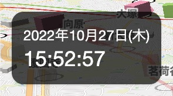

The current date and time is displayed at the top left of the screen. It is convenient when accessing from overseas because Japan standard time is always displayed. When [Playback Mode](#playback-mode) is on, additional buttons appear below the current time to change the time and the speed at which the time progresses.

See [here](#playback-mode) for details on Playback Mode.

### Displaying Detailed Information on Trains and Airplanes

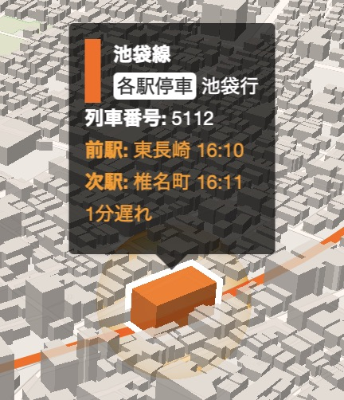 

Place the mouse pointer or tap on the train or airplane to display detailed information about it. Detailed train information includes railway name, train type, destination, train number, previous or standing station and departure time, next station and arrival time, delay time, and operation information. Flight details include airline name, flight number, departure or arrival location, status, departure or arrival time, and code-share information. If there is a train delay or a flight schedule change, the change will be highlighted in orange.

### Displaying Detailed Information on Stations

Place the mouse pointer or tap on the station to display detailed information about it. Detailed information includes station photo, station names, and connecting line names. If a station has different names for different lines but is a single transfer station, the information will be displayed together.

### Tracking Trains and Airplanes

Clicking or tapping on a train or airplane will turn on [Tracking Mode](#tracking-mode) and the screen will automatically move following the movement of the train or airplane. There are two types of Tracking Modes, the “Helicopter Tracking Mode” and the “Heading Tracking Mode”, and you can enjoy the scenery along the railway in your favorite Tracking Mode. When Tracking Mode is on, the map panning and rotating operations are disabled (you can zoom in/out and change the tilt). Clicking on a map with no trains or airplanes turns Tracking Mode off.

See [here](#tracking-mode) for details on Tracking Modes.

### Sharing Trains and Flights

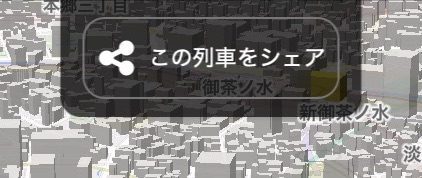

When [Tracking Mode](#tracking-mode) is on, the “Share this train” or “Share this flight” button will appear at the top of the screen. Clicking the button will bring up an additional menu, depending on the device you are using, and you can send the tracking URLs for the trains or flight and optional messages through messaging apps, email or social networking apps. When the recipient of the information opens the URL in their browser, Mini Tokyo 3D will be launched, and they will be able to track the same train or flight.

This feature is only available in the following browsers: Edge, Safari, Chrome (Android), Opera (Android) and Samsung Internet

### Delayed Train

When [Playback Mode](#playback-mode) is off, orange spheres are displayed around trains that are delayed for more than 1 minute. It is easy to see which sections on the map have the delay.

### Displaying Station Exit Information

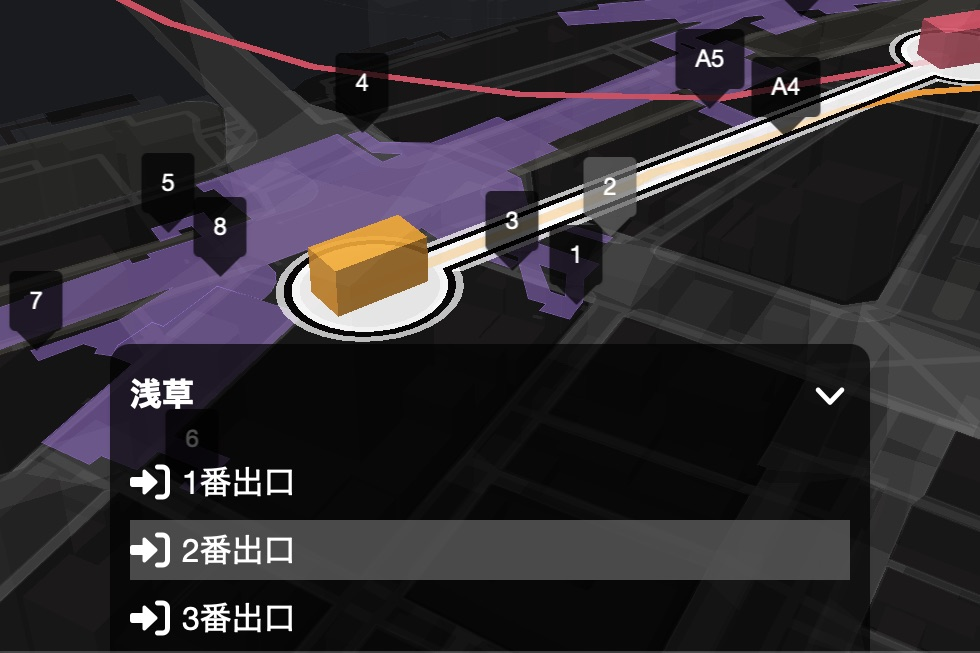

When you click or tap on a station, the station is selected and the map around the station is enlarged to show the locations and names of the exits on the map. When a station is selected, a list of exits will be displayed at the bottom of the screen. If you move the mouse pointer over the name of the exit in the list or tap it, the name of the exit will be highlighted on the map and you can check the location. Clicking on the map where no station exists will deselect it.

### Route Search

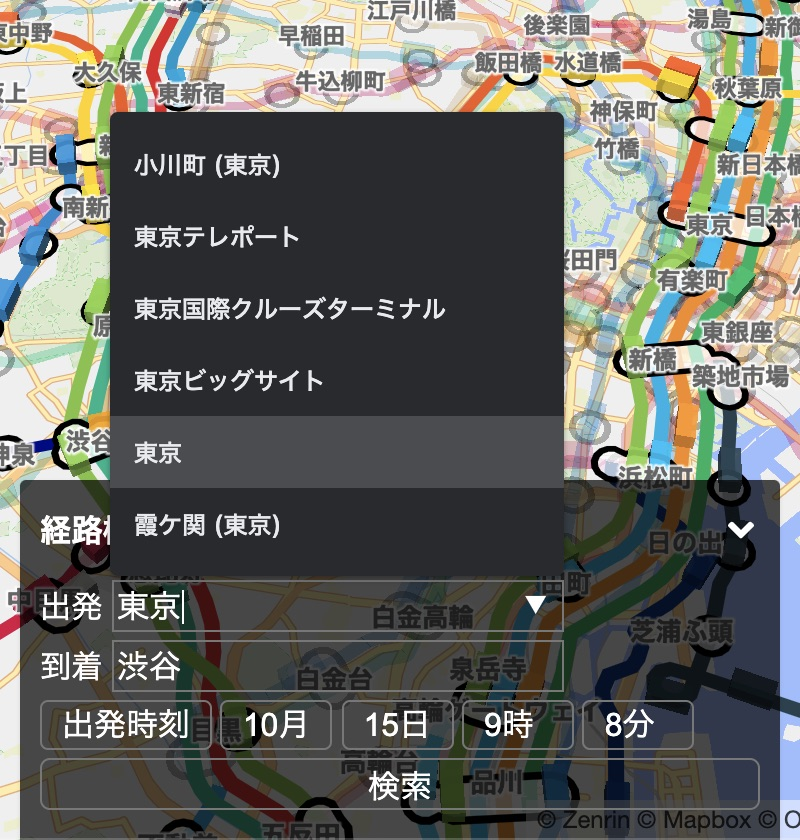 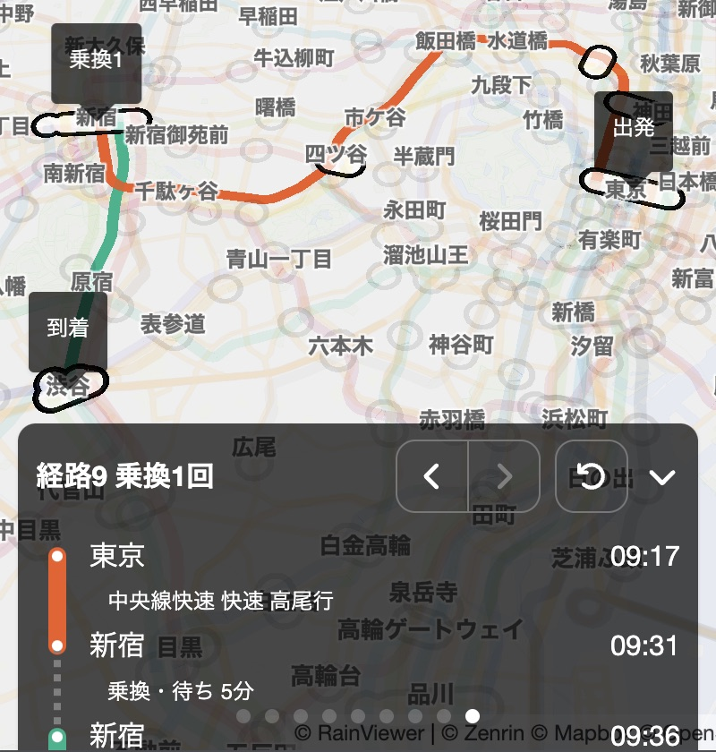 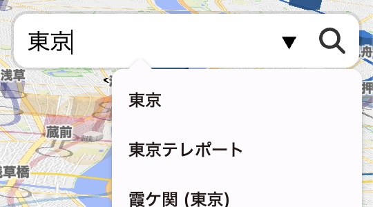

When you click or tap the search icon button, the search window appears at the bottom of the screen to allow you to search for a route. Enter the departure and arrival station names, select the departure time, and click or tap the search button. Then, a recommended route will be highlighted on the map, and the search window will display information such as the trains to take, arrival and departure times, and transfer stations. Depending on the conditions, multiple route suggestions may be displayed, and you can switch between routes by pressing the “<” and “>” buttons at the top of the search window or swiping horizontally on the window. You can also click or tap the “Back” icon button to return to the search criteria.

When you enter a part of the station name, a list of candidates will be displayed, and you can select one from the list to complete your input. In Japanese, Korean, and Chinese environments, you can also search by English name. If you enter an invalid station name and press the search button, the border around the station name field will be highlighted in orange, and you will be prompted to correct the station name.

You can also enter the departure and arrival stations by clicking or tapping on the stations on the map. When you click or tap on a station name input box in the search window, the focus will move and the border will turn light blue. Then, lick or tap a station on the map to enter the station name in the input box.

Trains, airplanes and layers will be temporarily hidden when the search window is displayed. To close the search window, click the search icon button again.

**Note**: As of the version 2.8, there are some limitations: you can only specify the time of departure, and you can only search for the train of the day.

## Display Modes

### Full Screen Mode

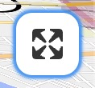

Click or tap the screen zoom icon to toggle Full Screen Mode on or off.

When Full Screen Mode is on, you can cancel Full Screen Mode by pressing Esc key instead of clicking / tapping the button.

### Underground Mode

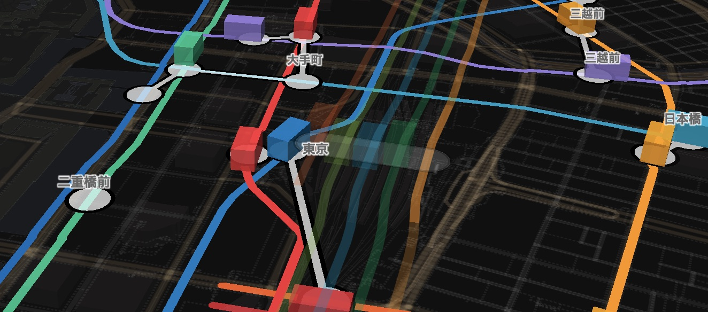 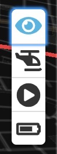

Click or tap the eye icon button to turn Underground Mode on or off (the icon is in light blue when it is on).

When Underground Mode is on, the map will turn dark and overground railways, stations, trains and airplanes will be translucent, while underground railways, stations and trains will appear brighter.

When Underground Mode is off, the map will return to normal, overground railways, stations, trains and airplanes will be displayed brightly, and underground railways, stations and trains will be translucent.

You can also switch modes by clicking or tapping underground trains with Underground Mode off, or clicking or tapping overground trains with Underground Mode on. In addition, the mode is automatically switched when the train being tracked enters the underground from the ground or exits from the underground to the ground.

### Tracking Mode

   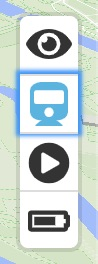

Click or tap on a train or airplane to turn Tracking Mode on and the screen will automatically follow the movement of the train or airplane (the icon will appear in light blue when it is on). Clicking on a map with no trains or airplanes turns Tracking Mode off.

The helicopter icon indicates the “Helicopter Tracking Mode”, and it makes a 360 degree turn around the target train or airplane. The train icon indicates the “Heading Tracking Mode”, and it tracks the target train or airplane from above or diagonally behind in the direction of travel up. Click or tap the icon button to toggle between the “Helicopter Tracking Mode” and the “Heading Tracking Mode”.

When Tracking Mode is on, the timetable and current position of the train being tracked is displayed at the bottom of the screen. For the train connecting to other lines, the timetables of those lines are also shown. The timetable can be scrolled by using the mouse wheel, dragging the scroll bar, or dragging your finger. Click on the "∨" icon in the upper right corner of the timetable to hide the timetable at the bottom of the screen, or click on the "∧" icon to display it again.

Also, when Tracking Mode is on, some devices will display the [share button](#sharing-trains-and-flights) to share the train or flight being tracked.

### Playback Mode

Click or tap the playback icon button to switch Playback Mode on or off (the icon is in light blue when it is on).

When Playback Mode is on, you can change the date and time and the speed at which time progresses, so you can check the operation of a train on a specific date and time, or enjoy the train operation throughout the entire day as if you were watching model trains in motion. In this state, trains will run according to the timetables and no real-time information will be reflected. For airplanes, only the flights taking off and landing that day will be displayed.

When Playback Mode is off, trains and airplanes are displayed on the map according to the actual operation at the current time. Because it uses real-time information, the location on the map will change accordingly if there is a train delay or flight schedule change.

When Playback Mode is turned on, the “Edit date & time” button and the “+” and “-” buttons to change the playback speed appear just below the time display. If you click or tap the “Edit date & time” button, you will enter the date/time editing mode. The “+” and “-” buttons appear above and below the year, month, day, hour, minute, and second numbers. Use these buttons to change the date and time, and click or tap the "OK" button to confirm the change. Clicking or tapping the "Cancel" button will cancel the change and return to the original setting time. You can also change the playback speed by clicking or tapping the “+” and “-” buttons on the left and right of the number that indicates the speed. It can be set to between 1x (the same speed as real time) and 600x, in increments of 1 from 1x to 10x, 10 from 10x to 100x, and 100 from 100x to 600x.

 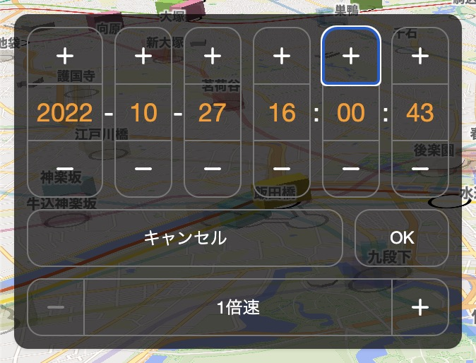

### Eco Mode

Click or tap the battery icon button to turn on or off the Eco Mode (the icon is in light blue when it is on).

When Eco Mode is on, the display interval for trains and airplanes will be increased to reduce power consumption and device heating. This is suitable for use with mobile devices that run on battery power.

When Eco Mode is off, trains and airplanes are animated smoothly at 60 frames per second. Suitable for use on a PC or display device connected to a power source.

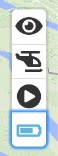

## Configuration

### Layer Display Settings

 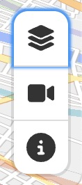

Click or tap the layer icon button to show the Layer Display Settings panel. In the Layer Display Settings panel, you can turn on/off the layer that is superimposed on the map. Precipitation layer, Fireworks layer and Live Cameras layer are available. Click or tap the “x” button in the top right corner of the panel, or click or tap outside the panel to close the panel.

Click or tap the Precipitation layer button to turn the precipitation animation on or off (the outer frame of the icon is shown in light blue when it is on). Based on real-time weather information, 8 levels of precipitation intensity are displayed in 3D animation in 1km mesh units.

Click or tap the Fireworks layer button to turn the fireworks animation on or off (the outer frame of the icon is shown in light blue when it is on). The fireworks animation will appear at a specific location on the map at a scheduled date and time.

Click or tap on the Live Cameras layer button to toggle the display of the live camera buttons on and off (the outer frame of the icon is shown in light blue when it is on). Clicking or tapping on the live camera buttons on the map will zoom in on the location and show the live camera video being broadcast from the same viewpoint. The video is transmitted in real time, but there is a delay of a few tens of seconds, so the actual train tends to appear slightly later than the movement of the train on the map. Clicking on a map where there is no live camera button will deselect the live camera.

### Showing Application Information

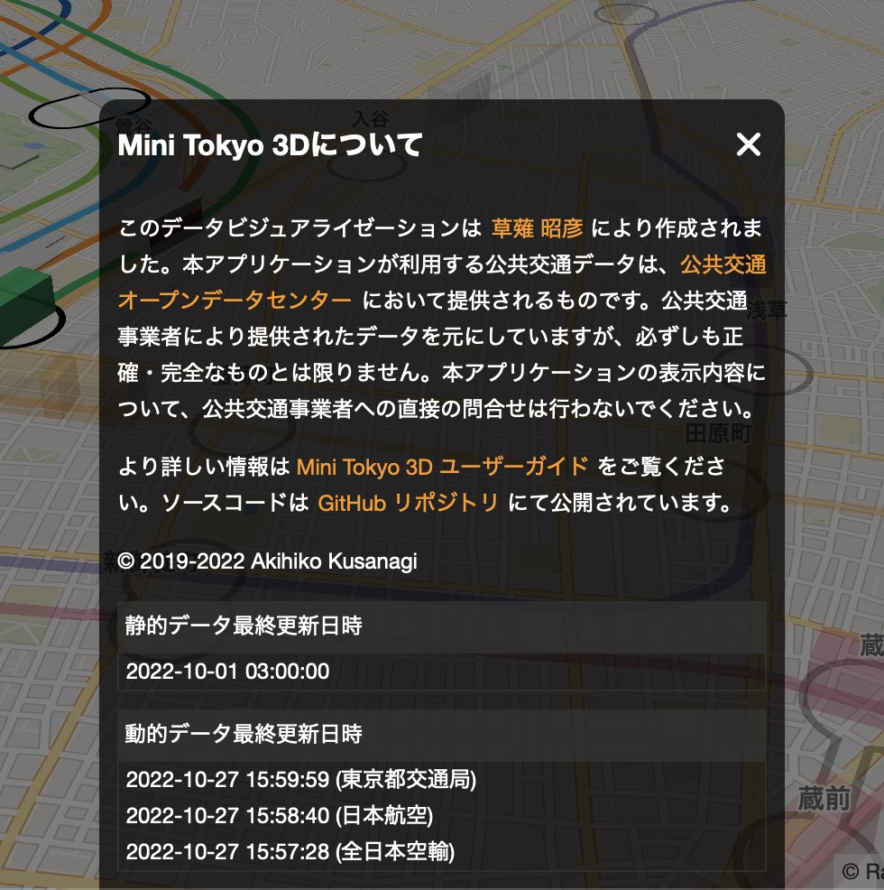 

Click or tap the information icon button to show application and data information. The last update time of static data and dynamic data is also displayed. Click or tap the “x” button in the top right corner of the panel, or click or tap outside the panel to close the panel.

## About Data

This application uses the following data.

- [Open Data Challenge for Public Transportation in Tokyo](https://tokyochallenge.odpt.org/en/)
- [Public Transportation Open Data Center](https://www.odpt.org)
- [Mapbox](https://www.mapbox.com)
- [OpenStreetMap](https://www.openstreetmap.org)
- [Japan Meteorological Agency Precipitation Nowcast](https://www.jma.go.jp/en/radnowc/)
- [Haneda Airport Flight Course](https://www.ntrack.mlit.go.jp)

The source of the public transportation data in this application is the Open Data Challenge for Public Transportation in Tokyo and the Public Transportation Open Data Center. They are based on the data provided by the public transportation operators. The accuracy and integrity of the data are not guaranteed. Please do not contact the public transportation operators directly regarding the content of this application.

## Supported Browsers

This application has been tested with the following browsers. Chrome is recommended. Internet Explorer is not supported.

- Chrome 94 (Mac OS, Windows, iOS, Android)
- FireFox 93 (Mac OS, Windows, iOS)
- Safari 14 (Mac OS, iOS)
- Edge 94 (Mac OS, Windows, iOS)

## Development Information

The source code for this application is available at the [GitHub repository](https://github.com/nagix/mini-tokyo-3d). The development history is summarized in [Mini Tokyo 3D Development Diary](https://togetter.com/li/1413307) (in Japanese).

## Contact

For inquiries on this application, please contact the following email address.

mini-tokyo-3d@nagi-p.com
