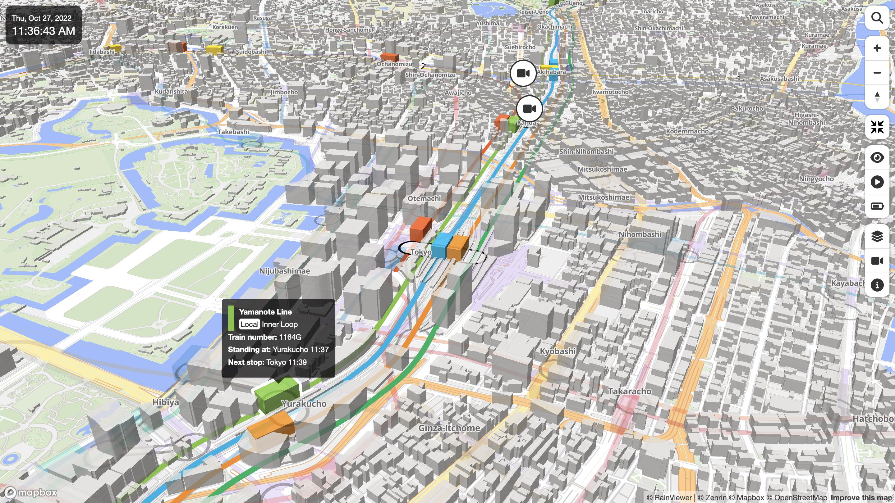

# Mini Tokyo 3D User Guide

日本語版は[こちら](USER_GUIDE-ja.md)でご覧いただけます。

## Mini Tokyo 3D Overview

Mini Tokyo 3D is a real-time 3D map of public transportation in Tokyo. Trains in operation and airplanes that are arriving or departing are represented on a realistic 3D map with smooth animation. This is a “digital twin” that looks exactly like the real world in the digital world.

Users can freely move around on the 3D map and zoom in on the places they want to see to know the “now” of Tokyo. It can be used in various ways such as looking for the transfer route as a route map, checking the destination town and weather before going out, just watching the way along the railway by automatically tracking a train and judging if you should dash to not miss the final train from the current position of the train.

Mini Tokyo 3D is a web application that you can run in any web browser, regardless of device, such as PCs, smartphones, tablets, and set-top boxes. Please use the following URL to access.

[https://nagix.github.io/mini-tokyo-3d/](https://nagix.github.io/mini-tokyo-3d/)

The features of Mini Tokyo 3D are as follows.

### All in Real-Time

You can view trains and airplanes that operate according to actual timetables and real-time delay information from your favorite point of view. The color of the scenery changes according to the sunrise and sunset times in Tokyo, and the sunset glow can be seen. In addition, a rain animation based on real-time weather information is displayed, so you can enjoy more realistic scenery.

### Easy-To-Read Railroad Map

Mini Tokyo 3D is using the same line colors used in official route maps and guidance, and arranges each railway at an appropriate interval according to the scale of the map to display the route in an easy-to-read form. If the names of two or more stations are different, but passengers can transfer from one to others, the connections between the stations are displayed to support smooth transfer. The shape of the train is a simple solid color cuboid that enhances symbolism.

### Operability and Performance

Over 1,100 trains run at the same time during the rush hour, but with the optimized data structure and processing logic, a very smooth operation animation is realized even on smartphones. Smooth animation of 60 frames per second is used everywhere, including viewpoint movement, switching between overground and underground views, and fading in and out of trains and airplanes.

### Support for 4 Languages

In addition to Japanese, Mini Tokyo 3D supports English, Chinese and Korean, which are popular with tourists visiting Japan. Not only the user interface texts but also railway names, station names, train types, airport names and airline names are also multilingualized. For the user interface texts, Thai and Nepali are also supported.

### Train Operation and Display as Close as Possible to Reality

Fine tuning of the starting acceleration and maximum speed of the trains was done repeatedly by getting on them, so that they would move in the same way as the actual trains. A train composition changes according to the scale of the map so that it matches the actual train length, and if the scale is above a certain level, the actual number of vehicles obtained from real-time data feed is displayed. The underground tunnel sections of the overground railways and the overground sections of the subways are also completely reproduced.

**[Updated on December 16, 2019]** As there was a possibility of conflict with existing patents, we disabled displaying of vehicles corresponding to the train length.

### Switching Views Between Overground and Underground

 

The railway network in Tokyo is one of the most complex in the world. Mini Tokyo 3D is pursuing ease of viewing by switching between the overground and underground railway networks as well as clearly expressing subway train operations that are invisible in reality.

## Screen and Operations

### Screen Description

1. **Date and Time**: See [Date and Time](#date-and-time)
2. **Search Button**: See [Station Search](#station-search)
3. **Navigation Buttons**: See [Zooming-In/Out](#zooming-inout) and [Rotation and Tilting](#rotation-and-tilting)
4. **Display Mode Switching Buttons**: See [Display Modes](#display-modes)
5. **Application Information Button**: See [Showing Application Information](#showing-application-information)

### Panning

You can move your location by panning the map with mouse drag or swipe on the screen. You can also pan the map with the arrow keys on your keyboard.

### Zooming-In/Out

 
"50">

Click or tap the “+” or “−” icon button to zoom in or out the map. You can also zoom in or out by rotating the mouse wheel or pinching in or out of the screen.

You can also zoom in or out the map by pressing the “=” or “−” key on the keyboard. You can also zoom in the map with a double click of the mouse or double tap on the screen.

A box zoom can be used by dragging the mouse while holding down the Shift key on the keyboard and selecting a rectangle on the screen.

### Rotation and Tilting

 

The compass icon represents the orientation of the map. If you press the compass icon button and drag or swipe, you can rotate the map by moving left and right, and change the tilt of the map by moving up and down. You can also change the rotation and tilt of the map by dragging with the right mouse button, or by dragging with the left mouse button while holding down the Ctrl key on the keyboard.

You can also change the rotation and tilt of the map by holding down the Shift key on your keyboard and pressing the arrow keys. You can also rotate the map by pinching the screen.

Click or tap the compass icon button and the bearing will be reset to true north.

### Tracking Trains and Airplanes

Clicking or tapping on a train or airplane will turn on [Tracking Mode](#tracking-mode) and the screen will automatically move following the movement of the train or airplane. There are two types of tracking modes, the “Helicopter Tracking Mode” and the “Rear Tracking Mode”, and you can enjoy the scenery along the railway in your favorite tracking mode. When the tracking mode is on, the map panning and rotating operations are disabled (you can zoom in/out and change the tilt). Clicking on a map with no trains or airplanes turns the tracking mode off.

See [here](#tracking-mode) for details on tracking modes.

### Date and Time

When [Real-Time Mode](#real-time-mode) is on, the current data and time is displayed at the top left of the screen. It is convenient when accessing from overseas because Japan standard time is always displayed.

### Displaying Vehicle Composition by Zooming-In

 

As you zoom in on the map, you will see a number of connected vehicles based on the actual train vehicle composition. For example, the Yamanote Line has 11 vehicles and the Tokaido Line has 11 or 15 vehicles depending on the train. The number of vehicles is obtained from real-time data.

**[Updated on December 16, 2019]** As there was a possibility of conflict with existing patents, we disabled displaying of vehicles corresponding to the train vehicle composition.

### Delayed Train

When [Real-Time Mode](#real-time-mode) is on, orange spheres are displayed around trains that are delayed for more than 1 minute. It is easy to see which sections on the map have the delay.

### Displaying Detailed Information on Trains and Airplanes

 

When [Real-Time Mode](#real-time-mode) is on, place the mouse pointer or tap on the train or airplane to display detailed information about the train or airplane. Detailed train information includes railway name, train type, destination, train number, previous or standing station and departure time, next station and arrival time, delay time, and operation information. Flight details include airline name, flight number, departure or arrival location, status, departure or arrival time, and code-share information. If there is a train delay or a flight schedule change, the change will be highlighted in orange.

### Station Search

When you click or tap the search icon button, a search window appears and you can enter text. Enter a station name and press Enter key, or click or tap the search icon button to move to the target station on the map. Once you enter a part of the station name, a list of candidates will be displayed. In Japanese, Korean, and Chinese environments, you can also search by English name.

### Showing Application Information

Click or tap the information icon button to show application and data information. The last update time of static data and dynamic data is also displayed.

## Display modes

### Full Screen Mode

Click or tap the screen zoom icon to toggle full screen mode on or off.

When full-screen mode is on, you can cancel full-screen mode by pressing Esc key instead of clicking / tapping the button.

### Underground Mode

 

Click or tap the eye icon button to turn the underground mode on or off (the icon is in light blue when it is on).

When underground mode is on, the map will turn dark and the overground railways, stations, trains and airplanes will be translucent, while the underground railways, stations and trains will appear brighter.

When underground mode is off, the map will return to normal, overground railways, stations, trains and airplanes will be displayed brightly, and underground railways, stations and trains will be translucent.

You can also switch modes by clicking or tapping underground trains with underground mode off, or clicking or tapping overground trains with underground mode on. In addition, the mode is automatically switched when the train being tracked enters the underground from the ground or exits from the underground to the ground.

### Tracking Mode

   

Click or tap on a train or airplane to turn tracking mode on and the screen will automatically follow the movement of the train or airplane (the icon will appear in light blue when it is on). Clicking on a map with no trains or airplanes turns tracking mode off.

The helicopter icon indicates the “Helicopter Tracking Mode”, and it makes a 360 degree turn around the target train or airplane. The train icon indicates the “Rear Tracking Mode”, and it tracks the direction of travel from diagonally behind the target train or airplane. Click or tap the icon button to toggle between the “Helicopter Tracking Mode” and the “Rear Tracking Mode”.

### Real-Time Mode

Click or tap the clock icon button to switch the real-time mode on or off (the icon is in light blue when it is on).

When real-time mode is on, trains and airplanes are displayed on the map according to the actual operation at the current time. Because it uses real-time information, the location on the map will change accordingly if there is a train delay or flight schedule change.

When the real-time mode is off, you can enjoy the operation of the trains going back and forth on each route as if you were watching the movement of the model trains.

### Precipitation Display

 

Click or tap the rain cloud icon button to switch the rain animation display on or off (the icon is in light blue when it is on).

Based on real-time weather information, 8 levels of precipitation intensity are displayed in 3D animation in 1km mesh units.

## About Data

This application uses the following data.

- [Open Data Challenge for Public Transportation in Tokyo](https://tokyochallenge.odpt.org/en/)
- [OpenStreetMap](https://www.openstreetmap.org)
- [Japan Meteorological Agency Precipitation Nowcast](https://www.jma.go.jp/en/radnowc/)

The source of the public transportation data in this application is the Open Data Challenge for Public Transportation in Tokyo. They are based on the data provided by the public transportation operators. The accuracy and integrity of the data are not guaranteed. Please do not contact the public transportation operators directly regarding the content of this application.

## Supported Browsers

This application has been tested with the following browsers. Chrome is recommended. Internet Explorer is not supported.

- Chrome 78 (Mac OS, Windows)
- FireFox 70 (Mac OS, Windows)
- Safari 13 (Mac OS, iOS)
- Edge 44 (Windows)

## Development Information

The source code for this application is available at the [GitHub repository](https://github.com/nagix/mini-tokyo-3d). The development history is summarized in [Mini Tokyo 3D Development Diary](https://togetter.com/li/1413307) (in Japanese).

## Contact

For inquiries on this application, please contact the following email address.

mini-tokyo-3d@nagi-p.com
