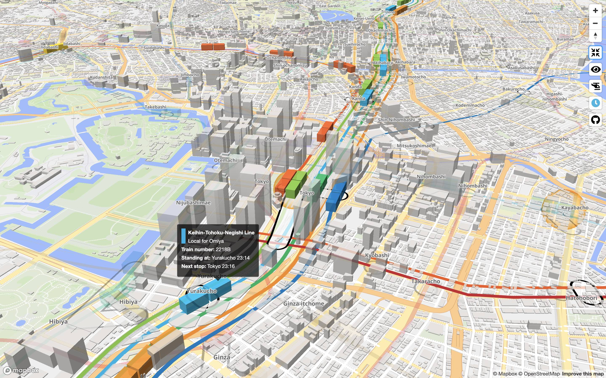
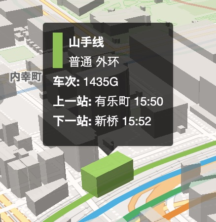
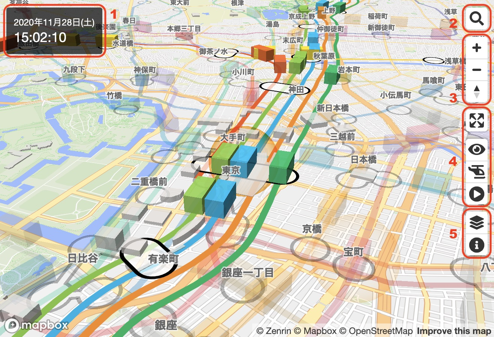
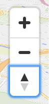
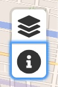
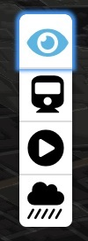
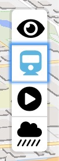
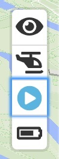

# Mini Tokyo 3D ユーザーガイド

English version is available [here](USER_GUIDE-en.md).

本ドキュメントは、Mini Tokyo 3D の機能や操作方法について説明します。開発者向けの情報については、[Mini Tokyo 3D 開発者ガイド](DEVELOPER_GUIDE-ja.md)をご覧ください。

## Mini Tokyo 3D 概要

Mini Tokyo 3D は東京の公共交通のリアルタイム3Dマップです。今、実際に動いている列車や発着している旅客機をリアルな3Dマップ上に滑らかなアニメーションで表現します。これは、現実世界とそっくりな双子をデジタルの世界に表現した「デジタルツイン」です。

ユーザーは自由に3Dマップ上を動き回り、見たいところにズームインして東京の「今」を知ることができます。路線図として乗り換えルートを調べる、出かける前に目的地の街と天気を下調べする、列車を自動追跡して沿線の様子をただひたすら眺める、終電に逃さないためにダッシュすべきかどうか列車の現在位置から判断するなど、さまざまな使い方ができます。

Mini Tokyo 3D は PC、スマートフォン、タブレット、セットトップボックスなど、デバイスを問わず Web ブラウザさえあれば利用できる Web アプリケーションです。下記の URL からアクセスしてください。

[https://minitokyo3d.com](https://minitokyo3d.com)

Mini Tokyo 3D の特徴は次の通りです。

### 全てがリアルタイム

現実の時刻表、さらにはリアルタイムの遅延情報に従って運行する列車や旅客機を上空の好きな視点から観覧できます。東京の日の出・日の入り時刻に合わせて景色の明るさが変わり、夕焼けも見られます。また、リアルタイムの気象情報を基にした降水アニメーションが表示されるため、よりリアルな風景を楽しめます。

### 鉄道路線図の見やすさをそのままに

路線図や案内で使われているものと同じラインカラーを使用し、地図の縮尺に合わせて各路線を適切な間隔で配置してルートを見やすい形で表現します。駅名が異なっていても乗り換え駅である場合には駅間の接続を表示して、スムーズな乗り換えをサポートします。列車の形はあえてシンプルな単色の直方体にして、シンボル性を高めています。

### 操作性とパフォーマンス

ラッシュ時には1,200を超える列車が同時に走りますが、最適化されたデータ構造と計算処理により、スマートフォンでも非常にスムーズな運行アニメーションを実現。視点移動や地上・地下表示の切り替え、列車・旅客機のフェードイン・アウトなど、60フレーム/秒のスムーズなアニメーションを随所に利用しています。

### 4ヶ国語対応

日本語以外に、訪日観光客の多い英語・中国語（簡体字・繁体字）・韓国語に対応。ユーザーインターフェース表示だけではなく、路線名、駅名、列車種別、空港名、航空会社名なども多言語化。ユーザーインターフェース表示に限り、タイ語・ネパール語にも対応しています。

### 現実に限りなく近づけた列車運行と表示

実際の列車と同じ動きになるように、乗車しながら列車の起動加速度や最高速度の微調整を繰り返しました。地上を走る列車の地下トンネル部分、地下鉄の地上走行区間も完全に再現しています。

### 地上・地下の表示切り替え

 

東京の鉄道ネットワークは世界有数の複雑度。地上と地下の路線網を切り替えて表示することで見やすさを追求するとともに、地下鉄路線の現実には見えない列車の運行をわかりやすく表現します。

## 画面・操作説明

### 画面の説明

1. **時刻表示**: [時刻表示](#%E6%99%82%E5%88%BB%E8%A1%A8%E7%A4%BA)をご覧ください
2. **検索ボタン**: [駅名検索](#%E9%A7%85%E5%90%8D%E6%A4%9C%E7%B4%A2)をご覧ください 
3. **ナビゲーションボタン**: [地図の拡大・縮小](#%E5%9C%B0%E5%9B%B3%E3%81%AE%E6%8B%A1%E5%A4%A7%E7%B8%AE%E5%B0%8F)、[地図の回転と傾きの変更](#%E5%9C%B0%E5%9B%B3%E3%81%AE%E5%9B%9E%E8%BB%A2%E3%81%A8%E5%82%BE%E3%81%8D%E3%81%AE%E5%A4%89%E6%9B%B4)をご覧ください
4. **表示モード切り替えボタン**: [表示モード](#%E8%A1%A8%E7%A4%BA%E3%83%A2%E3%83%BC%E3%83%89)をご覧ください
5. **アプリ情報ボタン**: [アプリ情報の表示](#%E3%82%A2%E3%83%97%E3%83%AA%E6%83%85%E5%A0%B1%E3%81%AE%E8%A1%A8%E7%A4%BA)をご覧ください

### 地図のスクロール

マウスまたは指のドラッグで地図をスクロールして場所を移動することができます。また、キーボードの方向キーでも地図をスクロールすることができます。

### 地図の拡大・縮小

 

「＋」「−」アイコンボタンをクリックまたはタップすると、地図を拡大・縮小することができます。また、マウスホイールの回転または画面のピンチイン・アウトで地図を拡大・縮小することができます。

さらに、キーボードの「＝」「−」キーを押すことでも地図を拡大・縮小することができます。マウスのダブルクリックまたはトリプルタップで地図を拡大、キーボードの Shift キーを押しながらマウスのダブルクリックまたは2本指でのタップで縮小することもできます。

キーボードの Shift キーを押しながらマウスをドラッグして画面上の矩形を選択することで、対象範囲を拡大することができます。

### 地図の回転と傾きの変更

 

コンパスアイコンは、地図の向きを表しています。コンパスアイコンボタンを押して左右方向にドラッグすると、地図を回転させることができます。また、マウスの右ボタンを押してドラッグ、またはキーボードの Ctrl キーを押しながらマウスの左ボタンを押してドラッグすることで地図の回転と傾きを変更することができます。2本指で上下方向にドラッグして地図の傾きを変更することもできます。

さらに、キーボードの Shift キーを押しながら方向キーを押すことでも地図の回転と傾きを変更することができます。画面のピンチ操作で地図を回転することもできます。

コンパスアイコンボタンをクリックまたはタップすると、地図が真北を向くように回転します。

### 時刻表示

画面左上に現在時刻が表示されます。常に日本時間が表示されるため、海外からのアクセス時に便利です。[再生モード](#%E5%86%8D%E7%94%9F%E3%83%A2%E3%83%BC%E3%83%89)がオンの状態では、現在時刻の他に時刻や時間の経過速度を変更するためのボタンが表示されます。

再生モードの詳細については[こちら](#%E5%86%8D%E7%94%9F%E3%83%A2%E3%83%BC%E3%83%89)をご覧ください。

### 列車・旅客機の詳細情報の表示

 

列車や旅客機にマウスポインタを合わせたり、タップをすると列車や旅客機の詳細情報が表示されます。列車の詳細情報は、路線名、列車種別、行先、列車番号、前駅または停車駅と発車時刻、次駅と到着時刻、遅延時間、運行情報を含みます。旅客機の詳細情報は、航空会社名、便名、出発地または到着地、状況、出発時刻または到着時刻、コードシェアを含みます。列車の遅延もしくは旅客機のスケジュール変更がある場合は、変更部分がオレンジ色でハイライトされます。

### 駅の詳細情報の表示

駅にマウスポインタを合わせたり、タップをすると駅の詳細情報が表示されます。詳細情報は、駅の写真、駅名、乗り入れ路線名を含みます。駅名が異なっても乗り換え駅である場合は、まとめて表示されます。

### 列車・旅客機の追跡

列車や旅客機をクリックまたはタップすると、[追跡モード](#%E8%BF%BD%E8%B7%A1%E3%83%A2%E3%83%BC%E3%83%89)がオンに切り替わり、列車や旅客機の動きに追随して画面が自動的に移動します。追跡モードには「ヘリコプター追跡モード」と「進行方向追跡モード」の2種類があり、お好みの追跡モードで沿線の風景を楽しむことができます。追跡モードがオンの状態では、地図のスクロール・回転操作は無効になります（拡大・縮小、傾きの変更は可能です）。列車や旅客機が存在しない地図上をクリックすると、追跡モードがオフに切り替わります。

追跡モードの詳細については[こちら](#%E8%BF%BD%E8%B7%A1%E3%83%A2%E3%83%BC%E3%83%89)をご覧ください。

### 列車・フライトのシェア

[追跡モード](#%E8%BF%BD%E8%B7%A1%E3%83%A2%E3%83%BC%E3%83%89)がオンの状態では、画面上部に「この列車をシェア」または「このフライトをシェア」ボタンが表示されます。ボタンをクリックすると、利用しているデバイスに応じて追加のメニューが表示され、追跡中の列車やフライトを示す URL と任意のメッセージをメッセージアプリやメール、SNSアプリなどで送信することができます。情報を受け取った人がその URL をブラウザで開くと、同じ列車やフライトを追跡した状態で Mini Tokyo 3D が起動します。

この機能は Safari (Mac OS、iOS)、Chrome (Android)、Opera (Android)、Samsung Internet の各ブラウザでのみ利用可能です。

### 遅延列車の表示

[再生モード](#%E5%86%8D%E7%94%9F%E3%83%A2%E3%83%BC%E3%83%89)がオフの状態では、1分以上遅延している列車には周囲にオレンジ色の球が表示されます。地図上のどの区間で遅れがあるかが一目瞭然です。

### 駅出口情報の表示

駅をクリックまたはタップすると駅が選択された状態になり、駅周辺の地図が拡大表示されて出口の場所と名前が地図上に表示されます。駅が選択された状態では、出口の一覧が画面下部に表示されます。一覧の中で出口の名前にマウスポインタを合わせたり、タップをすると地図上の出口の名前がハイライトされ、場所の確認をすることができます。駅が存在しない地図上をクリックすると、駅の選択状態が解除されます。

### 駅名検索

検索アイコンボタンをクリックまたはタップすると、検索ウインドウが現れてテキスト入力が可能になります。駅名を入力して Enter キーを押すか、検索アイコンボタンをクリックまたはタップすると、マップ上の対象の駅に移動します。駅名の一部を入力すると候補の一覧が表示されるため、その中から選択して入力を補完することもできます。日本語・韓国語・中国語の環境では、英語名での検索も可能です。

### アプリ情報の表示

情報アイコンボタンをクリックまたはタップすると、アプリおよびデータの情報が表示されます。静的データ・動的データの最終更新日時も表示されます。

## 表示モード

### フルスクリーンモード

画面拡大・縮小アイコンボタンをクリックまたはタップすると、フルスクリーンモードのオン・オフを切り替えることができます。

フルスクリーンモードがオンの状態では、ボタンをクリック／タップする以外に、Esc キーを押すことでフルスクリーンモードを解除できます。

### 地下モード

 

眼アイコンボタンをクリックまたはタップすると、地下モードのオン・オフを切り替えることができます（オンの状態でアイコンは水色で表示されます）。

地下モードがオンの状態では、地図が暗転して地上の路線や駅、列車や旅客機が半透明になる一方で、地下の路線、駅、列車が明るく表示されます。

地下モードがオフの状態では、地図が通常表示に戻って地上の路線や駅、列車や旅客機が明るく表示され、地下の路線、駅、列車は半透明になります。

このほか、地下モードがオフの状態で地下の列車をクリックまたはタップしたり、地下モードがオンの状態で地上の列車をクリックまたはタップしたりするとモードが切り替わります。また、追跡中の列車が地上から地下に入ったり、地下から地上に出るときもモードが自動的に切り替わります。

### 追跡モード

   

列車や旅客機をクリックまたはタップすると、追跡モードがオンに切り替わり、列車や旅客機の動きに追随して画面が自動的に移動します（オンの状態でアイコンは水色で表示されます）。列車や旅客機が存在しない地図上をクリックすると、追跡モードがオフに切り替わります。

ヘリコプターアイコンは「ヘリコプター追跡モード」を示しており、対象の列車や旅客機を中心に360度旋回を行います。列車アイコンは「進行方向追跡モード」を示しており、対象の列車や旅客機の上空または斜め後方から進行方向を上にして追跡します。アイコンボタンをクリックまたはタップすると「ヘリコプター追跡モード」と「進行方向追跡モード」が交互に切り替わります。

追跡モードがオンの状態では、追跡中の列車の時刻表と現在位置が画面下部に表示されます。他社路線に乗り入れる列車については、乗り入れ先の路線の時刻表も含めて表示されます。時刻表はマウスホイール、スクロールバーのドラッグ、もしく指でのドラッグにてスクロールさせることができます。時刻表の右上の「∨」アイコンをクリックすると時刻表が画面下部に隠れ、「∧」アイコンをクリックすると再表示されます。

また、追跡モードがオンの状態では、デバイスによっては追跡中の列車やフライトをシェアするための[シェアボタン](#%E5%88%97%E8%BB%8A%E3%83%BB%E3%83%95%E3%83%A9%E3%82%A4%E3%83%88%E3%81%AE%E3%82%B7%E3%82%A7%E3%82%A2)が表示されます。

### 再生モード

再生アイコンボタンをクリックまたはタップすると、再生モードのオン・オフを切り替えることができます（オンの状態でアイコンは水色で表示されます）。

再生モードがオンの状態では、時刻や時間の経過速度を自由に変えることができるため、特定の日時の列車の運行を確認したり、一日の列車の運行をまるで鉄道模型の動きを見るように楽しむことができます。この状態では、列車は時刻表通りの運行になり、リアルタイムの情報は反映されません。また、旅客機は当日の離着陸便のみが表示されます。

再生モードがオフの状態では、列車や旅客機は現在時刻の実際の運行に合わせて地図上に表示されます。リアルタイム情報を利用しているため、列車の遅延や旅客機のスケジュールの変更がある場合にはそれに合わせて地図上の位置が変わります。

再生モードをオンにすると、時刻表示のすぐ下に「日付時刻を変更」ボタンと再生速度を変更するための「＋」「−」ボタンが現れます。ここで「日付時刻を変更」ボタンを押すと、日付時刻編集モードに入ります。年・月・日・時・分・秒を表す数字の上下に「＋」「−」ボタンが現れるので、このボタンを使用して日付時刻を変更し、「OK」ボタンを押すと変更が確定されます。「キャンセル」ボタンを押すと、変更がキャンセルされて元の設定時刻に戻ります。また、再生速度を表す数字の左右にある「＋」「−」ボタンを押すと、再生速度が変わります。1倍速(現実の時間の流れと同じ速度)〜600倍速の間で設定することが可能です。1〜10倍速の間は1刻み、10〜100倍速の間は10刻み、100〜600倍速の間は100刻みになります。

 

### 降水表示

 

雨雲アイコンボタンをクリックまたはタップすると、降水アニメーションの表示のオン・オフを切り替えることができます（オンの状態でアイコンは水色で表示されます）。

リアルタイムの気象情報を基に、1kmメッシュ単位で8段階の降水強度を 3D アニメーションで表示します。

## データについて

本アプリケーションは次のデータを利用しています。

- [東京公共交通オープンデータチャレンジ](https://tokyochallenge.odpt.org)
- [公共交通オープンデータセンター](https://www.odpt.org)
- [Mapbox](https://www.mapbox.com)
- [OpenStreetMap](https://www.openstreetmap.org)
- [気象庁降水ナウキャスト](https://www.jma.go.jp/jp/radnowc/)
- [国土交通省東京航空局羽田飛行コース](https://www.ntrack.mlit.go.jp)

本アプリケーションが利用する公共交通データは、東京公共交通オープンデータチャレンジおよび公共交通オープンデータセンターにおいて提供されるものです。公共交通事業者により提供されたデータを元にしていますが、必ずしも正確・完全なものとは限りません。本アプリケーションの表示内容について、公共交通事業者への直接の問合せは行わないでください。

## 対応ブラウザ

次のブラウザで動作を確認しています。推奨は Chrome です。Internet Explorer には非対応です。

- Chrome 85 (Mac OS, Windows, iOS, Android)
- FireFox 81 (Mac OS, Windows, iOS)
- Safari 14 (Mac OS, iOS)
- Edge 85 (Mac OS, Windows)

## 開発情報

本アプリケーションのソースコードは [GitHub リポジトリ](https://github.com/nagix/mini-tokyo-3d) にて公開されています。開発の経緯は [Mini Tokyo 3D 開発日誌](https://togetter.com/li/1413307) にまとめています。

## 問い合わせ先

本アプリケーションに関するお問い合わせは、以下のメールアドレスにお願いします。

mini-tokyo-3d@nagi-p.com
